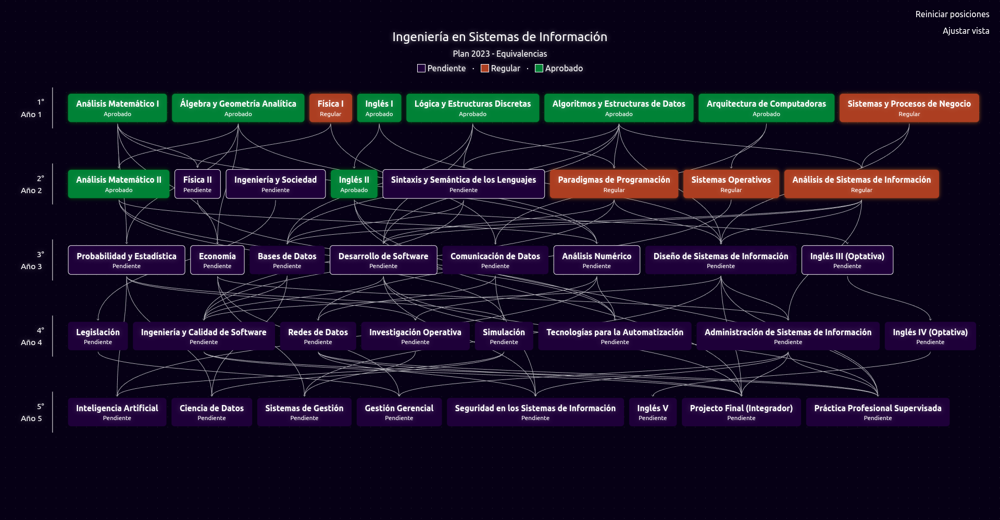
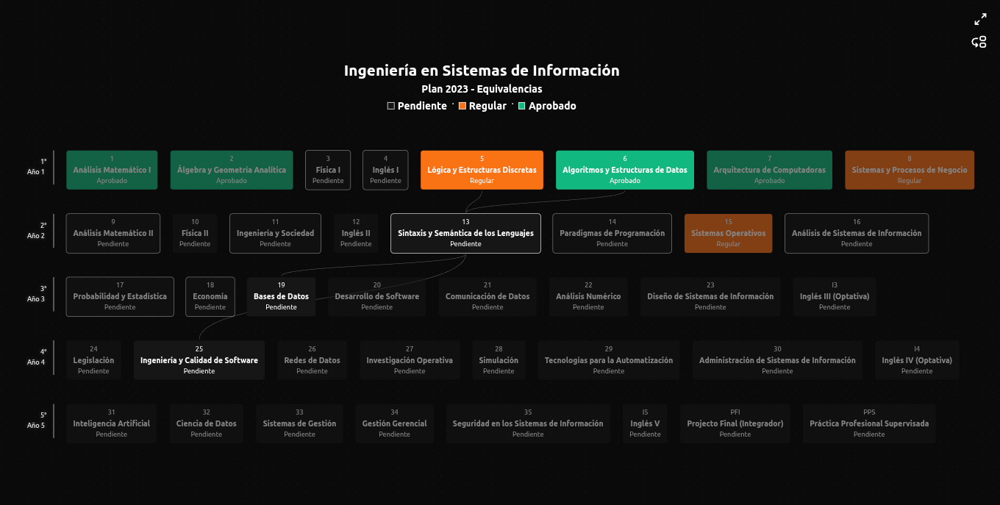
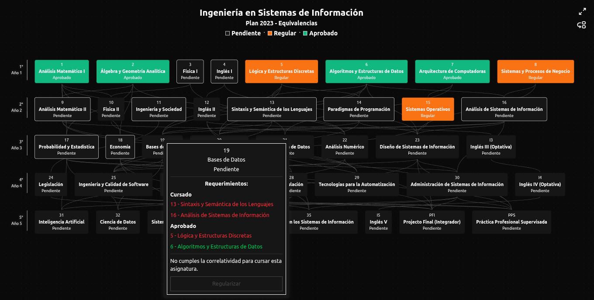

# Correlativy 📚️ #

Track my university progress through interactive nodes. Visualize course prerequisites and identify which courses I can take based on my completed subjects.





## Stack 🛠️ 

* ReactJS
* Vite
* Typescript
* TailwindCSS
* Zustand
* ReactFlow

## Prerequisites 📦️
* Node.js (v20.19+ or 22.12+) 
* npm (Node Package Manager) 

## Install 💻️

```bash
git clone https://github.com/httpniki/correlativy
cd correlativy/
```

## Usage ✈️

```bash
# Development mode
npm run dev

# Build and run
npm run build && npm run start
```
